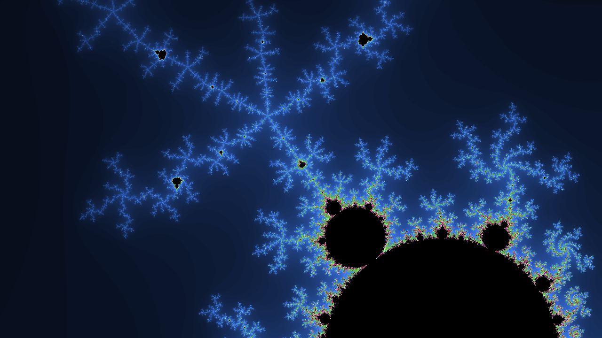

# ManCLbrot

Simple renderer of the [Mandelbrot set](https://en.wikipedia.org/wiki/Mandelbrot_set) using OpenCL hardware acceleration.




## Building

Standard CMake procedure

```
cmake -B build .
cmake --build build
```

or, for older versions of CMake

```
mkdir build
cd build
cmake ..
make
```


## Usage

Execute with `./build/manclbrot`.
Adding `--help` shows a usage message with available command line options.

While running, use

* arrow keys to navigate
* `+` / `-` to zoom
* `[Space]` to regenerate the color palette
* `[PgUp]` / `[PgDown]` to change the iteration limit

